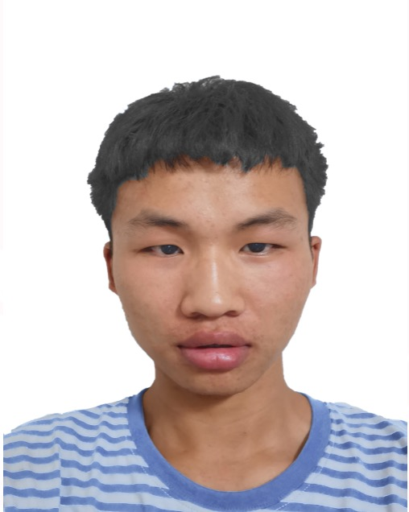

## 李劲哲																												

**邮箱：lijingz@mails.ccnu.edu.cn** 

**出生年月：2002年3月**

**籍贯：江苏省盐城市**

### 教育背景

* 华中师范大学（211工程、双一流建设高校）		计算机学院计算机科学与技术（基地班）		2020.09-2024.07
* 主要课程：线性代数、高等数学、概率统计、操作系统、计算机组成原理、数据结构、数据库原理
* 软件技能：掌握Python、Golang语言及Pytorch、Flask等相关框架
* 所获荣誉：校三好学生两次、国家励志奖学金一次、华为一等奖学金一次、博雅丹桂奖学金一次

### 科研经历

* 国家级大创“灵犀2.0:基于多模态情感分析的抑郁症患者在线画像构建”	第一负责人	2022.04-2023.04

### 竞赛经历

* 第十三届蓝桥杯全国软件和信息技术专业人才大赛湖北赛区Python程序设计大学A组一等奖
* 第十五届中国大学生计算机设计大赛中南赛区一等奖

* 2022全国大学生数学建模竞赛湖北赛区二等奖

### 综合发展

* 曾担任华中师范大学木犀互联网技术团队2022年主管
* 曾担任华中师范大学学工部ihuada网络文化中心部委
* 参与志愿时长超过100小时

### 姓名：汤先宁

------

#### 个人介绍

------

- 华中师范大学计算机学院华为基地班成员
- 信息安全协会会长
- 主修课程：数据结构，计算机组成原理，操作系统，计算机网络。

#### 教育背景

------

- 2020-至今 华中师范大学 计算机学院 在读

#### 项目经历

------

- 大创项目《基于区块链和隐私保护技术实现的疫苗护照系统》

### 姓名：张旷 

#### 个人介绍

张旷，华中师范大学计算机学院华为基地班成员，主修课程：数据结构，计算机组成原理，操作系统，计算机网络。

#### 教育背景

- 2020-至今 华中师范大学 计算机学院 在读

#### 项目经历

- 木犀团队后端成员
- 华师武理交友小程序《小程序》
- 大创项目《树洞机器人》

### 姓名：刘晗

#### 个人介绍

刘晗，华中师范大学计算机学院华为基地班成员，主修课程：数据结构，计算机组成原理，操作系统，计算机网络。

#### 教育背景

- 2020-至今 华中师范大学 计算机学院 在读

#### 项目经历

- 参与制作数据库期末大作业《博客管理系统》

