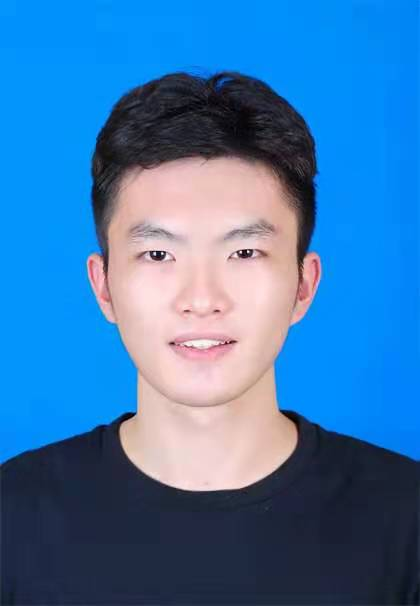

### 姓名：李劲哲

------

#### 个人介绍

------

#### 教育背景

------

#### 项目经历

------

### 姓名：汤先宁

------

#### 个人介绍

------

汤先宁，华中师范大学计算机学院华为基地班成员，信息安全协会会长，主修课程：数据结构，计算机组成原理，操作系统，计算机网络。

#### 教育背景

------

- 2020-至今 华中师范大学 计算机学院 在读

#### 项目经历

------

- 第五届强网杯全国网络安全挑战赛强网先锋
- 大创项目《基于区块链和隐私保护技术实现的疫苗护照系统》

### 姓名：张旷

------

 

#### 个人介绍

------

张旷，华中师范大学计算机学院华为基地班成员，主修课程：数据结构，计算机组成原理，操作系统，计算机网络。

#### 教育背景

------

- 2020-至今 华中师范大学 计算机学院 在读

#### 项目经历

------

- 木犀团队后端成员
- 华师武理交友小程序《小程序》
- 大创项目《树洞机器人》

------

### 姓名：刘晗

------

#### 个人介绍

------

刘晗，华中师范大学计算机学院华为基地班成员，主修课程：数据结构，计算机组成原理，操作系统，计算机网络。

#### 教育背景

------

- 2020-至今 华中师范大学 计算机学院 在读

#### 项目经历

------

- 参与制作数据库期末大作业《博客管理系统》

